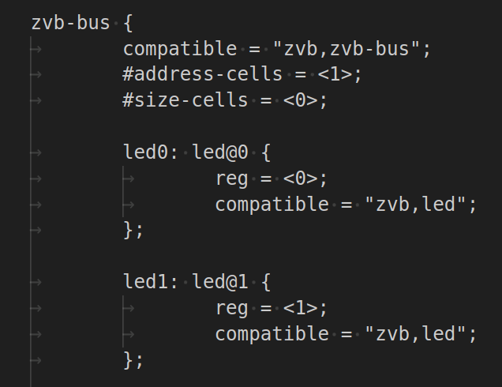
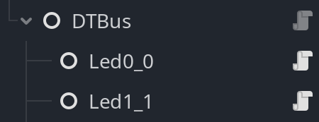

Zephyr Virtual Board (ZVB)
##########################

Overview
********

The Zephyr Virtual Board is a Zephyr-RTOS based project which
enables running a zephyr application in a virtual environment,
such as a game engine. The project currently provides a
virtual bus with a set of virtual devices which the zephyr
application interacts with, and the virtual environment
implements.

This project provides implementations of the virtual bus and
virtual hardware for the `Godot Engine <godot_engine_>`_. The
virtual hardware is provided as a set of assets for the
Godot Engine in the form of sensors and motors which can be
used with physics bodies, along with a devicetree like set
of nodes used to bind the zephyr application's devicetree
to specific sensors and motors within the game engine scene:

   Devicetree snippet

   DTBus snippet

Getting Started
***************

The project is split into two parts:

* A Zephyr-RTOS project
* A Godot Engine project

Both of these projects run on Debian and Ubuntu. The project
currently relies on the native_sim Zephyr-RTOS board, so if
you have not already, this is the time to dual boot, switch
to, or emulate Ubuntu or Debian.

Zephyr-RTOS project setup
=========================

Simply follow the official `Getting Started <zephyr_rtos_getting_started_>`_
guide. Once you are able to build and run hello world for the native_sim
board by running the following commands:

::

  west build -p -b native_sim zephyr/samples/hello_world
  west flash

You are ready to set up the zephyr virtual board project. The
zephyr virtual board project is a custom zephyr workspace. Before when you
ran the command:

::

  west init

you initialized the default workspace, now we will init the custom
zephyr virtual board project by running the following commands in a
new folder:

::

  west init -m https://github.com/bjarki-andreasen/zephyr-virtual-board
  west update

You should now have a workspace folder that looks near identical to the
first one, but with the new "zvb" folder present. In here you will find
the boards, drivers, subsystems, samples, etc which comprise the zephyr
virtual board project.

Godot Engine project setup
==========================

The 3D models used in the Godot Engine project are created in
`Blender <blender_org_>`_, which is used to import the models
into the Godot Engine as well.

* Download and extract `Blender <blender_org_>`_ version 4.5.3 from
  `Blender Downloads <blender_org_download_>`_.
* Download and extract `Godot Engine <godot_engine_>`_ version 4.5 from
  `Godot Engine Downloads <godot_engine_downloads_>`_.
* Git clone the `Godot Engine ZVB project <godot_engine_zvb_git_repo_>`_
* Launch the Godot Engine application
* Press **Import**
* Navigate to the cloned Godot Engine ZVB project folder
* Select the **project.godot** and open the project
* When prompted, provide the path to the Blender application

The Godot Engine project should now be imported and ready to run.

Running the project
===================

With the Godot Engine project opened, Navigate to and open the
**Levels/level_1.tscn** scene in the FileSystem window. Then right click on
the **level_1** tab, and select **Play This Scene**. A window should now
open with the game scene paused. Now, build and flash the Zephyr-RTOS ZVB
blinky sample. Now build and "flash" the ZVB blinky sample for the ZVB board.
This board is an extension of the native_sim board (evident by its target
identifier).

::

  west build -p -b native_sim/native/zvb zvb/samples/blinky
  west flash

Observe the game scene resume and LED0 blinking.

Things to try
*************

Buttons
=======

Try building the Zephyr-RTOS input_dump sample. This will print button
presses as you press the buttons on the board in the game engine scene.

::

  west build -p -b native_sim/native/zvb zephyr/samples/subsys/input/input_dump/
  west flash

Changing LED colors
===================

To get familiar with the Godot Engine, navigate to the **board.tscn**
scene, find **Led0** in the scene tree, press it, then press the **Color**
in the **Inspector** under **ZVBLed** and change it to your preference.

.. _godot_engine:
   https://github.com/godotengine/godot

.. _zephyr_rtos_getting_started:
   https://docs.zephyrproject.org/4.2.0/develop/getting_started/index.html

.. _godot_engine_downloads:
   https://godotengine.org/download/archive/4.5-stable/

.. _godot_engine_zvb_git_repo:
   https://github.com/bjarki-andreasen/zephyr-virtual-board-godot

.. _blender_org:
   https://www.blender.org/

.. _blender_org_download:
   https://download.blender.org/release/Blender4.5/
